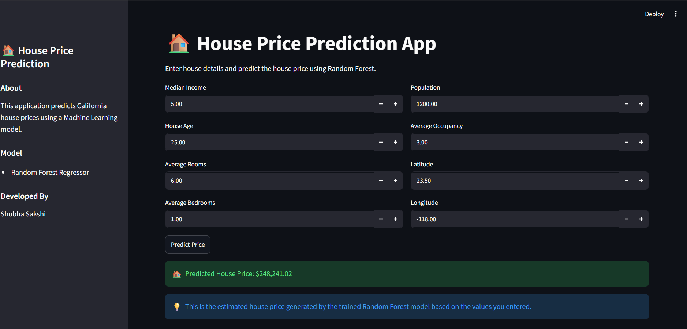
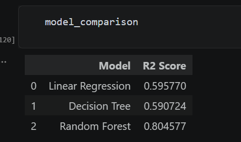
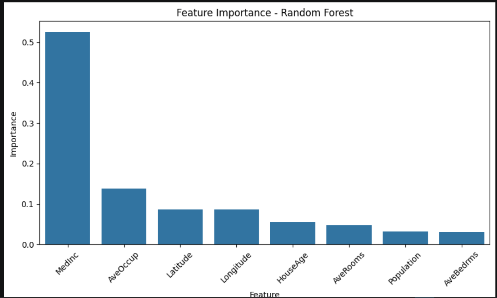

# 🏠 House Price Prediction using Machine Learning

## 📌 Project Overview

This project predicts house prices using Machine Learning algorithms. The California Housing Dataset was used for training and evaluation. Multiple regression models were tested and compared, and the best-performing model was deployed using Streamlit.

The objective of this project is to build an end-to-end Machine Learning pipeline including data preprocessing, model training, evaluation, model selection, and deployment.

---

## 🚀 Features

* Data preprocessing and feature scaling
* Exploratory Data Analysis (EDA)
* Multiple model training and comparison
* Random Forest Regressor implementation
* Model evaluation using R² Score
* Feature Importance Analysis
* Streamlit web application for real-time predictions
* Model serialization using Pickle

---

## 🛠️ Technologies Used

* Python
* Pandas
* NumPy
* Matplotlib
* Seaborn
* Scikit-Learn
* Streamlit
* Pickle

---

## 📊 Model Performance

The following models were trained and evaluated:

| Model                   | R² Score |
| ----------------------- | -------- |
| Linear Regression       | 0.595770 |
| Decision Tree Regressor | 0.590724 |
| Random Forest Regressor | 0.804577 |

### Best Model

✅ Random Forest Regressor achieved the highest R² Score and was selected as the final model.

---

## 📷 Project Screenshots

### Streamlit Application




### Model Comparison



### Feature Importance



---

## 🔍 Important Features

The Feature Importance analysis shows that:

* Median Income (MedInc) is the most influential feature.
* Average Occupancy (AveOccup) significantly affects house prices.
* Latitude and Longitude contribute to prediction accuracy.
* Population and Average Bedrooms have comparatively lower impact.

---

## 📂 Project Structure

House_Price_Prediction/

├── screenshots/

├── app.py

├── house_price_prediction.ipynb

├── model.pkl

├── scaler.pkl

├── README.md

---

## ▶️ Run the Project

### Clone Repository

```bash
git clone <repository-url>
cd House_Price_Prediction
```

### Install Dependencies

```bash
pip install -r requirements.txt
```

### Run Streamlit App

```bash
streamlit run app.py
```

---

## 🎯 Future Improvements

* Hyperparameter tuning
* Model deployment on cloud platforms
* User-friendly web interface enhancements
* Additional feature engineering
* Real-time data integration

---

## 👩‍💻 Author

**Shubha Sakshi**

Machine Learning & Data Science Enthusiast
